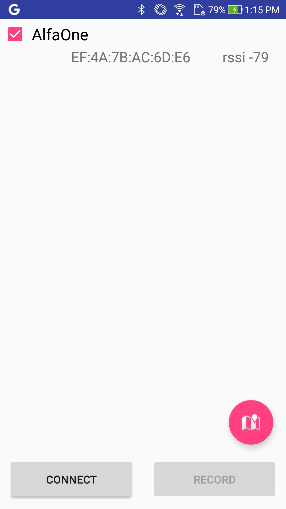
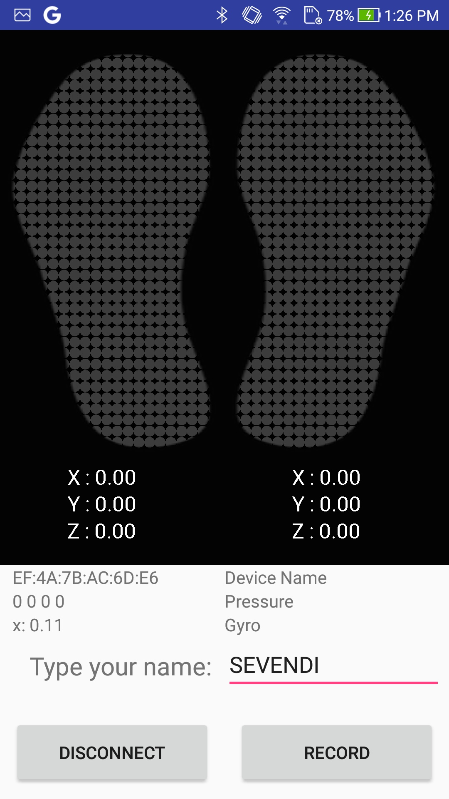
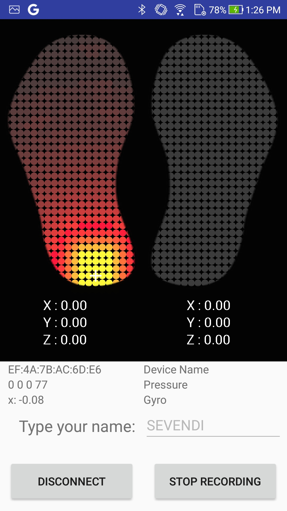
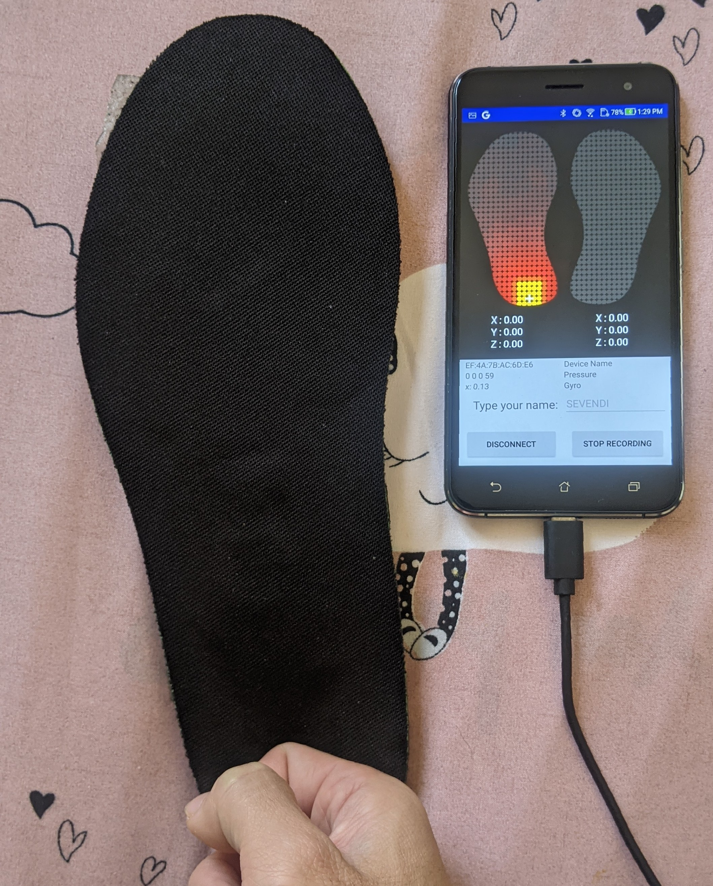
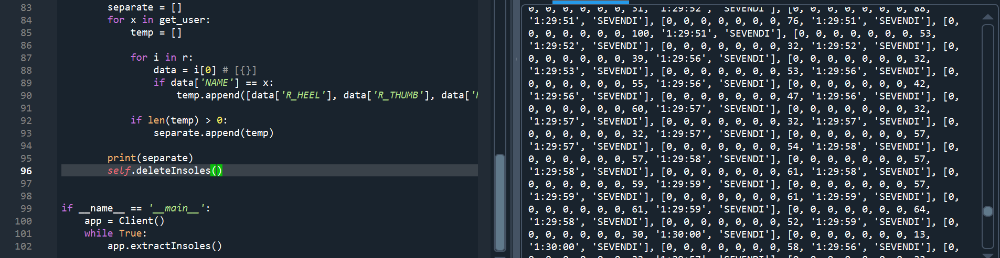

## Description
   
AlfaInsole is a mobile application which demonstrate how establish connection with insoles. 
It also support visualize pressure data and record sensors data.

**Please note this is a modified version of Alfasole V1.0.0. The version has been modified to meet our needs. The original version can be found [here](https://github.com/AlfaLoop/alfainsole).**

## Modifications that were made 

- A few changes and additions have been made to the application interface.
- We provide a form for each user to provide their unique identification number.
- We incorporate the system with a server, which sends the data of each user in real-time.
  
## Requirements
  
- Android deice with 5.0(API 21) or later(Bluetooth LE support)
  
- Android Studio 3.1.4(suggest, or Latest)
  
- Insole harware [AlfaOne]() and [NikePlus]()
  
  
## Functions
  
- Insoles data real-time visualization
  
- Central pointer of foot pressure calculation and visualization  
  
- Insoles data recording
  
- Support both AlfaOne and Nike plus insole
  

## Results
- Download the APK [here](https://github.com/spoluan/alfa-insole/tree/current/app/build/outputs/apk/debug).
- Detecting nearby 
	

		
	

- Before recording
	

		
	

- While recording
	

		
	

- Give pressure to the insole
	

		
	

- Retrieve the recorded data from Heroku server
	

		
	

## Thanks
 
[AlfaLoop](https://github.com/AlfaLoop)
  
 